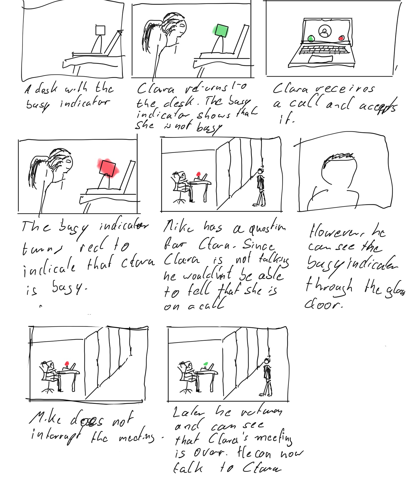
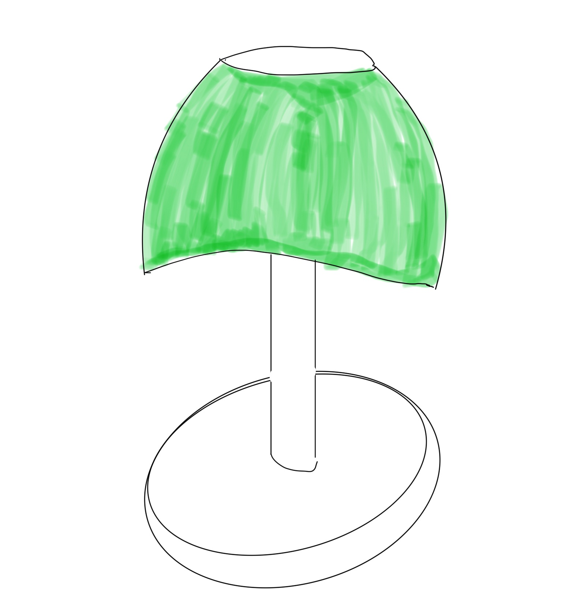
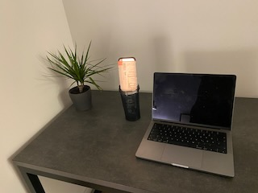
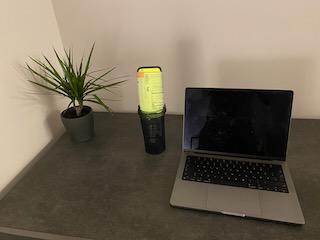
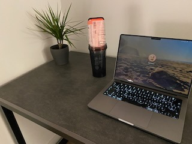

# Staging Interaction

In the original stage production of Peter Pan, Tinker Bell was represented by a darting light created by a small handheld mirror off-stage, reflecting a little circle of light from a powerful lamp. Tinkerbell communicates her presence through this light to the other characters. See more info [here](https://en.wikipedia.org/wiki/Tinker_Bell). 

There is no actor that plays Tinkerbell--her existence in the play comes from the interactions that the other characters have with her.

For lab this week, we draw on this and other inspirations from theatre to stage interactions with a device where the main mode of display/output for the interactive device you are designing is lighting. You will plot the interaction with a storyboard, and use your computer and a smartphone to experiment with what the interactions will look and feel like. 

_Make sure you read all the instructions and understand the whole of the laboratory activity before starting!_

## Prep
### Deliverables for this lab are: 
1. 7 Storyboards
1. 3 Sketches/photos of costumed devices
1. Any reflections you have on the process
1. Video sketch of 3 prototyped interactions
1. Submit the items above in the lab1 folder of your class [Github page], either as links or uploaded files. Each group member should post their own copy of the work to their own Lab Hub, even if some of the work is the same from each person in the group.

### The Report
This README.md page in your own repository should be edited to include the work you have done (the deliverables mentioned above). Following the format below, you can delete everything but the headers and the sections between the **stars**. Write the answers to the questions under the starred sentences. Include any material that explains what you did in this lab hub folder, and link it in your README.md for the lab.

## Lab Overview
For this assignment, you are going to:

A) [Plan](#part-a-plan) 

B) [Act out the interaction](#part-b-act-out-the-interaction) 

C) [Prototype the device](#part-c-prototype-the-device)

D) [Wizard the device](#part-d-wizard-the-device) 

E) [Costume the device](#part-e-costume-the-device)

F) [Record the interaction](#part-f-record)

Labs are due on Mondays. Make sure this page is linked to on your main class hub page.

## Part A. Plan 

_Setting:_ Where is this interaction happening? (e.g., a jungle, the kitchen) When is it happening?

The interaction is happening in an office with glass walls.

_Players:_ Who is involved in the interaction? Who else is there? If you reflect on the design of current day interactive devices like the Amazon Alexa, it’s clear they didn’t take into account people who had roommates, or the presence of children. Think through all the people who are in the setting.

- The user (Clara) who is working at a desk
- Her colleague Michelle who is somewhere else. 
- Herr colleague Mike that is coming to Clara

_Activity:_ What is happening between the actors?

Clara receives a call from Michelle who wants to give her a presentation of a new idea. She accepts the call and the Busy Indicator turns red. Mike wants to ask Clara a question goes to her office. When he gets to her office, he can see through the busy indicator that Clara is busy eventhough she is not talking. Therefore, he does not interrupt the call and returns at a later time.

_Goals:_ What are the goals of each player? (e.g., jumping to a tree, opening the fridge). 

Clara does want to follow Michelle's presentation without being disturbed. Mike does not want to disturb Clara while she is busy.

### Storyboard

### Feedback from other students
- The students generally like the idea of the Busy Indicator
- A suggestion was that Mike should be able to also check with an app if Clara is busy, because he might have had a long way to her office

## Part B. Act out the Interaction

It would be very cool if the busy indicator can automatically detect if the user is busy or not without needing to be manually switched from "not busy" to "busy". 

## Part C. Prototype the device

### Feedback on Tinkerbelle

Good for getting the general idea of prototyping and setting up an environment. 

## Part D. Wizard the device

## Part E. Costume the device

Only now should you start worrying about what the device should look like. Develop three costumes so that you can use your phone as this device.

Think about the setting of the device: is the environment a place where the device could overheat? Is water a danger? Does it need to have bright colors in an emergency setting?

\*\***Include sketches of what your devices might look like here.**\*\*

\*\***What concerns or opportunitities are influencing the way you've designed the device to look?**\*\*

Since it is standing on the desk and the user sees it a lot of time it should look very nice. Furthermore, the light should not be too bright to not disturb the user.

## Part F. Record

\*\***Take a video of your prototyped interaction.**\*\*

[Interaction begin work](https://youtube.com/shorts/XXBoXsAY46Y?feature=share)

[Interaction busy during call](https://youtube.com/shorts/Mmme8AqoxE4)

# Staging Interaction, Part 2 

This describes the second week's work for this lab activity.

## Prep (to be done before Lab on Wednesday)

You will be assigned three partners from another group. Go to their github pages, view their videos, and provide them with reactions, suggestions & feedback: explain to them what you saw happening in their video. Guess the scene and the goals of the character. Ask them about anything that wasn’t clear. 

\*\***Summarize feedback from your partners here.**\*\*

## Make it your own

Do last week’s assignment again, but this time: 
1) It doesn’t have to (just) use light, 
2) You can use any modality (e.g., vibration, sound) to prototype the behaviors! Again, be creative! Feel free to fork and modify the tinkerbell code! 
3) We will be grading with an emphasis on creativity. 

\*\***Document everything here. (Particularly, we would like to see the storyboard and video, although photos of the prototype are also great.)**\*\*
